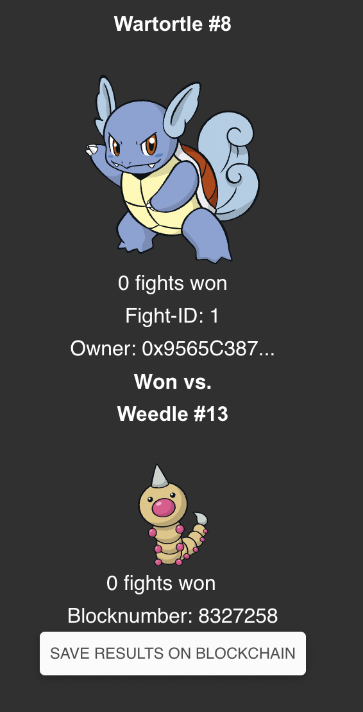

# Crypto Pokémon: A blockchain based game

## Developers

- Valeria Robles Garzón
- Luca Lunati

## Key UI features

- Mint Pokémon
- See your minted Pokémon and Pokémon minted by others
- Start fights against other Pokémon
- See the Winners and history of the fights
- Save fights to the blockchain

## Technologies used
- Javascript, ReactJS, CSS
- Solidity
- Cairo lang

## How to install and run Crypto Pokémon
This project was developed and tested on MacOS with browsers using the Metamask extension, other wallets supporting the Goaerli testnet may also work.

- Download bootstrap in the root folder with `npm install react-bootstrap bootstrap@5.1.3`
- `npm install`
- Navigate to /client 'cd client'
- `npm install`
- `npm start`
- The App should now open up in your browser and prompt you to connect your metamask wallet. Once your account is connected, you can use every feature!

## Important Project Files

- Under `./starknet_pokemon_game.cairo` is the starknet contract used for layer 2
- Under `./contracts/NFT.sol` is the solidity contract used for layer 1
- Under `./client` is the front end implementation
- Under `./tests` are tests for L1 and L2 contracts

## How to play Crypto Pokémon
Make sure you are logged in to MetaMask

- Pick a number between 1 and 52 and mint your Pokémon
- To start a fight, chose one of your Pokémon and an opponent that is not yours
- Pay the fee to start a fight on Layer 2
- Once the results have been accepted on the Ethereum Blockchain, it will be shown under 'All winners'
- If you wish to save your results to the blockchain and update your wins count, select the 'save to blockchain' button. (You must pay gas fees)
- If you want to know more about the fight, click on a fight result

Fight result: \

